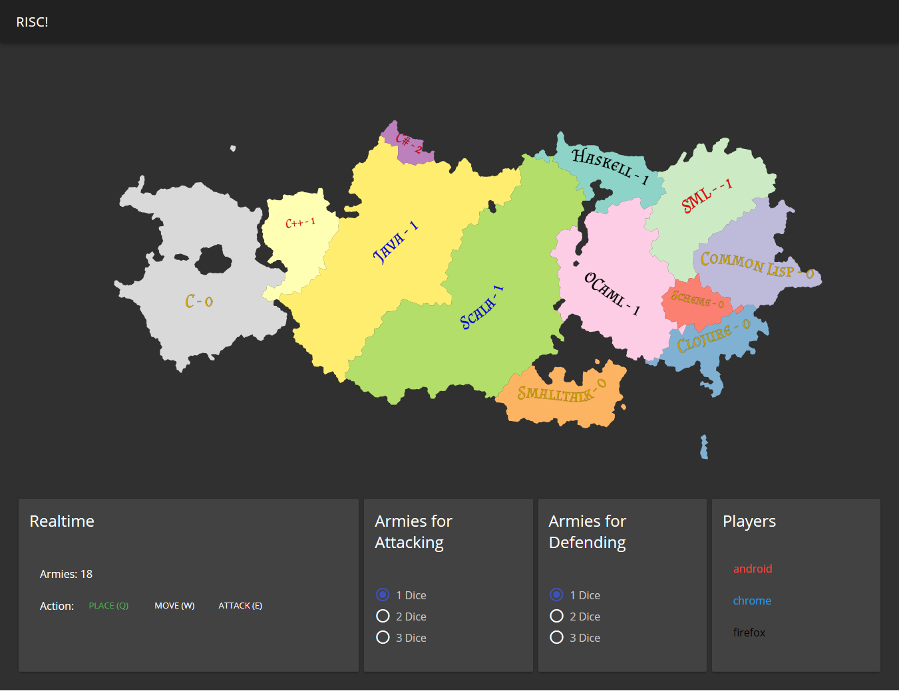

# CS2340 Scala Project Team 22

## Screenshots


## Backend [](https://buildkite.com/oswinso/hammer-tests)
The backend is written in Scala, using Scala Play and Akka streams, communicating to the frontend through WebSockets.

## Frontend
The frontend is written in Vue, using Vuetify for a Material look.

## Setup
To run the app, clone the repository, then run docker-compose using
```bash
docker-compose up
```
Alternatively, you can run the frontend and backend separately,

#### Backend:
```bash
cd backend
sbt run
```
#### Frontend:
```bash
cd frontend
npm install
npm run serve
```

## Usage
Check out the [tutorial](https://github.gatech.edu/dbansal36/CS2340Sp19Team22/wiki/Tutorial).

## Design Documentation
Our [design rationale](https://github.gatech.edu/dbansal36/CS2340Sp19Team22/wiki/Design) is documented here.
